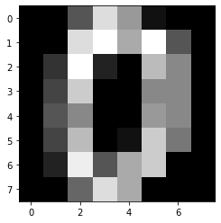
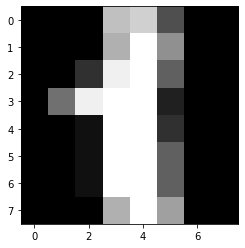
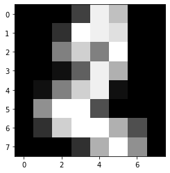
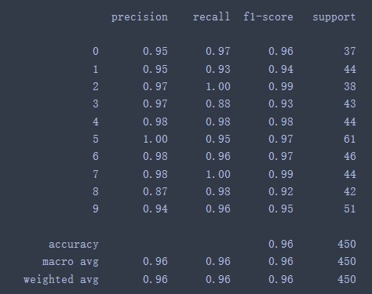
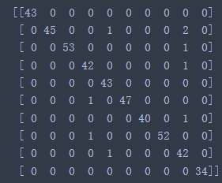

# 网易云课堂AI工程师实战项目：基于BP神经网络实现手写体识别
## Introduction(项目介绍)

This project is one of the NetEase cloud classroom AI engineers (computer vision) practical projects. Through the comprehensive use of numpy, matplotlib, and sklearn, the handwritten digital picture library training set (1347 picture samples) that comes with sklearn.datasets is randomly selected 30,000 times. Each learning iteration is 10,000 times, the learning rate is set to 0.11, the activation function is a sigmoid function, and BP neural network learning is performed. Finally, test the handwritten digital picture library test set (450 picture samples), and the recognition success rate is 0.96.

本项目为网易云课堂AI工程师（计算机视觉）实战项目之一，通过numpy、matplotlib、sklearn的综合运用，对sklearn.datasets自带的手写体数字图片库训练集（1347个图片样本）随机选取30000次，每次学习迭代10000次，学习率设置为0.11，激活函数为sigmoid函数，进行BP神经网络学习。最后测试手写体数字图片库测试集（450个图片样本），识别成功率为0.96。

## Requirements(项目步骤)

1. Load data
 Load sklearn.datasets load_digits comes with a sample library of handwritten pictures.
2. Data processing
 The label data is decimal and needs to be binarized. Segment the data sample (1797 pictures), 1/4 is the test set, 3/4 is the training set
3. Build the model
 Construct a BP neural network model. The neural network model is 3 layers, the input layer is set with 64 neurons, the hidden layer is set with 100 neurons, the output layer is set with 10 neurons, the learning rate is set to 0.11, and the activation function is sigmoid function. , The number of iterations for each learning is 10,000 times.
4. Training model
 The training set (1347 picture samples) of the picture library was randomly selected 30,000 times for training.
5. Test the model
 Test the test set (460 picture samples).

----------

			
1. 载入数据
 载入sklearn.datasets的load_digits自带手写体图片样本库。
2. 数据处理
 标签数据是十进制，需要二值化。对数据样本（1797张图片）进行切分，1/4为测试集，3/4为训练集
3. 构建模型
 构建BP神经网络模型，神经网络模型为3层，输入层设置64个神经元，隐藏层1层设置100个神经元，输出层设置10个神经元，学习率设置为0.11，激活函数为sigmoid函数，每次学习的迭代次数为10000次。
4. 训练模型
 对图片库训练集（1347个图片样本）随机选取30000次，进行训练。
5. 测试模型
 对测试集（460个图片样本）进行测试。

## IDE(项目环境)

- Jupyter Notebook6.0.1
- python3.7.4
- sklearn0.21.3

## Display(项目展示)

 &emsp;&emsp;&emsp;&emsp;&emsp;&emsp;手写体样本1

 &emsp;&emsp;&emsp;&emsp;&emsp;&emsp;手写体样本2

 &emsp;&emsp;&emsp;&emsp;&emsp;&emsp;手写体样本3

 &emsp;&emsp;&emsp;&emsp;&emsp;&emsp;&emsp;&emsp;&emsp;&emsp;&emsp;&emsp;&emsp;&emsp;&emsp;测试结果

 &emsp;&emsp;&emsp;&emsp;&emsp;&emsp;&emsp;&emsp;混淆矩阵

## Resources(项目资源)

- [AI engineer of Netease cloud classroom (computer vision)](https://mooc.study.163.com/smartSpec/detail/1001457001.htm)
- [网易云课堂AI工程师（计算机视觉）](https://mooc.study.163.com/smartSpec/detail/1001457001.htm)

## Thanks(鸣谢)

- [Netease cloud classroom ](https://mooc.study.163.com/)
- [网易云课堂](https://mooc.study.163.com/)